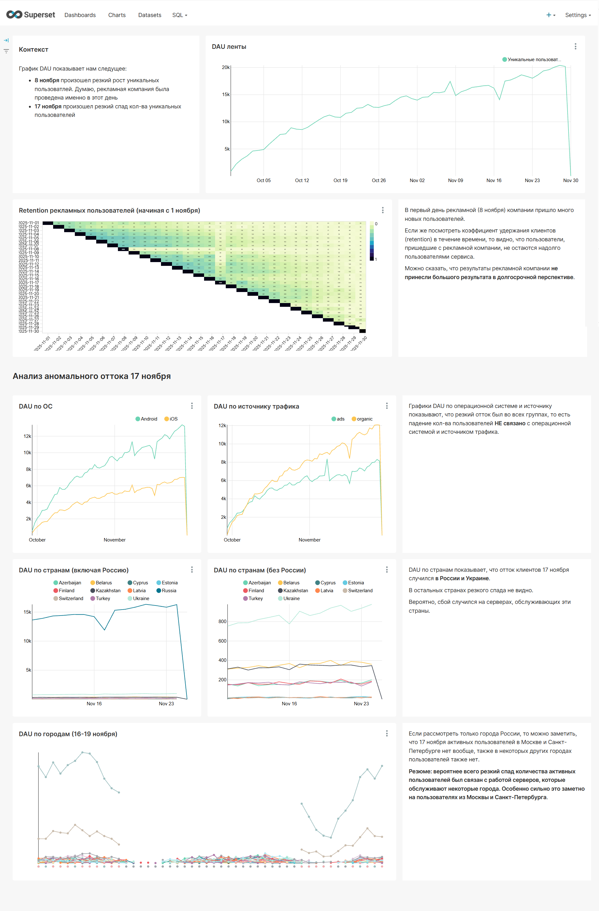

## Анализ результатов рекламной компании и выяснение причин падения аудитории

### Стек:

	
	
	
	

### Описание:

1. Проанализировать характер Retention пользователей, привлечённых рекламной кампанией. Что стало с рекламными пользователями в дальнейшем, как часто они продолжают пользоваться приложением?

2. Выяснить, какие пользователи не смогли воспользоваться лентой в день, когда резко упала аудитория. Что их объединяет?

### Результаты:

* Найдены дни начала рекламной компании и резкого падения аудитории 
* Рассчитан Retention для рекламного трафика
* Найден общий признак упавшего сегмента аудитории

PS: Задание принадлежит компании [karpov.cources](https://karpov.courses/simulator){target="_blank"}